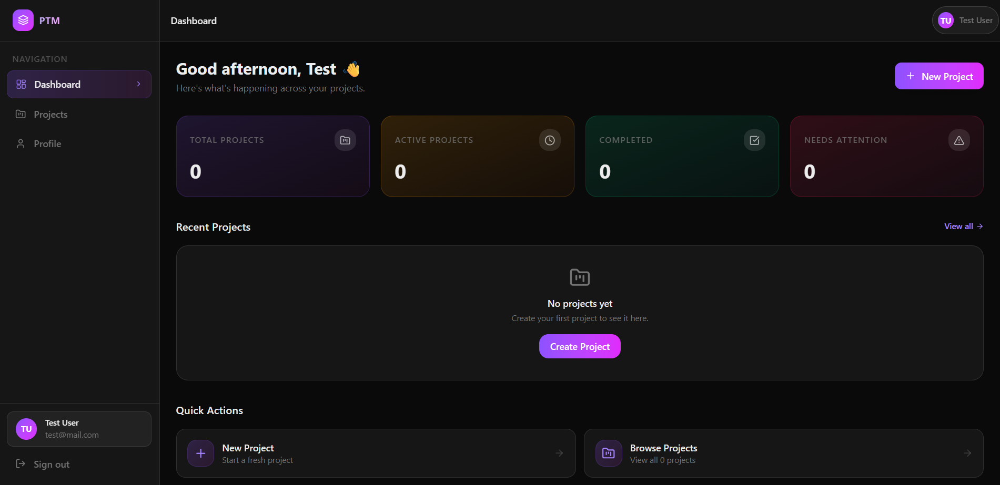

# 🚀 PTM - Project Tracking Manager

[](https://vitejs.dev/)
[](https://reactjs.org/)
[](https://www.typescriptlang.org/)
[](https://tailwindcss.com/)
[](https://redux.js.org/)
[](https://tanstack.com/query/latest)

A powerful, modern, and high-performance **Project Tracking Management (PTM)** system built with the MERN stack. Designed for teams that need a streamlined, intuitive interface to manage projects, tasks, and team collaboration.

---

## ✨ Key Features

- **📊 Dynamic Dashboard**: Get an overview of all active projects, pending tasks, and team productivity in real-time.
- **📁 Project Management**: Create, organize, and manage complex projects with ease.
- **👥 Team Collaboration**: Add members to specific projects and assign roles.
- **🔒 Secure Authentication**: Robust login and registration system with JWT and refresh token logic.
- **📱 Responsive Design**: Fully responsive UI building with Tailwind CSS 4 and Radix UI for maximum accessibility.
- **🔄 Real-time Data**: Integrated with TanStack Query for efficient data fetching and optimistic UI updates.
<!-- -   **🌗 Dark/Light Mode Support**: Seamless theme switching for a premium user experience. -->

---

## 🚀 Live Deployment

[](https://ptm.srmaharana.online)
[](#)

## 🛠️ Technology Stack

| Frontend           | Backend                | Utils/Icons         |
| :----------------- | :--------------------- | :------------------ |
| **React 19**       | **Node.js**            | **Lucide React**    |
| **Vite**           | **Express.js**         | **React Hot Toast** |
| **TypeScript**     | **MongoDB**            | **Formik & Yup**    |
| **Redux Toolkit**  | **Mongoose**           | **Axios**           |
| **Tailwind CSS 4** | **JWT Authentication** | **Radix UI**        |

---

---

## 🚀 Getting Started

### Prerequisites

- **Node.js** (v18 or higher)
- **npm** or **yarn**
- **MongoDB** (Local or Atlas instance)

### Installation

1.  **Clone the repository:**

    ```bash
    git clone https://github.com/yourusername/ptm.git
    cd ptm
    ```

2.  **Setup Backend:**

    ```bash
    cd server
    npm install
    # Create a .env file based on .env.example (or common fields)
    npm run dev
    ```

3.  **Setup Frontend:**
    ```bash
    cd ../client
    npm install
    npm run dev
    ```

---

## 📸 Screenshots

> 

---

<p align="center">
  Made with ❤️ by SRM
</p>
